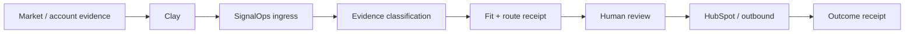

# SignalOps Workbench

**Evidence-to-action control plane for technical GTM.**

SignalOps turns market/account evidence into qualified, reviewable GTM action while preserving provenance, separating fact from inference, suppressing duplicate state, and requiring human authorization before external execution.



## 60-second GTM proof

| Surface | Current evidence state |
| --- | --- |
| Clay account/contact research | **OPERATED** — current GCC logistics cohort: 8 accounts / 15 operations or digital leaders; 10 contact channels resolved |
| Clay research integrity | **OPERATED** — public thought-leadership/custom-signal enrichment preserves explicit `no strong signal` instead of manufacturing personalization |
| Clay → SignalOps HTTP ingress | **IMPLEMENTED + CI VERIFIED** — deterministic receipt, evidence classes, duplicate suppression, optional shared-secret boundary |
| SignalOps routing | **IMPLEMENTED + TESTED** — explicit fit reasons, stable route IDs, terminal `human_review` |
| HubSpot read boundary | **LIVE INSPECTED** — company/contact/deal reads available in the connected portal |
| HubSpot bounded write | **IMPLEMENTED + TESTED; LIVE RECEIPT PENDING** — exactly one PATCH + fresh GET reconciliation; current connected write permission requires reauthorization |
| Autonomous outreach | **DISABLED** |
| Buyer adoption / revenue | **NOT CLAIMED** |

The distinction is deliberate: **working integration code is not presented as a live market outcome.**

## Employer-readable flow

```text
PUBLIC / MARKET EVIDENCE
        ↓
       CLAY
account discovery
contact targeting
enrichment / public research
        ↓
 SIGNALOPS GTM INGRESS
fact / inference / unknown / no_signal
stable identity + duplicate suppression
        ↓
 DECISION + ROUTING
explicit fit reasons
personalization eligibility
        ↓
    HUMAN REVIEW
        ↓
 HUBSPOT / DELIVERY
bounded mutation / approved execution
        ↓
   OUTCOME RECEIPT
reply → correction → pilot → repeat use → purchase
```

## Clay → SignalOps integration proof

Run the dedicated proof surface:

```bash
python -m venv .venv
# Windows: .venv\Scripts\activate
# macOS/Linux: source .venv/bin/activate
pip install -e .

export SIGNALOPS_CLAY_WEBHOOK_TOKEN="replace-with-random-secret"
uvicorn signalops.gtm_web:app --reload
```

Clay/webhook-compatible endpoint:

```text
POST /integrations/clay/events
```

The ingress contract accepts exactly four evidence classes:

- `fact`
- `inference`
- `unknown`
- `no_signal`

Every successful receipt preserves:

```text
next_action = human_review
send_actions_executed = false
crm_mutation_executed = false
```

See:

- [`docs/CLAY_SIGNALOPS_INGRESS_PROOF_2026_08_28.md`](docs/CLAY_SIGNALOPS_INGRESS_PROOF_2026_08_28.md) — architecture, exact payload, deploy/run steps, and live-receipt HITL checklist.
- [`examples/gtm_clay_ingress_fixture.json`](examples/gtm_clay_ingress_fixture.json) — sanitized request fixture.
- [`tests/test_gtm_ingress.py`](tests/test_gtm_ingress.py) — evidence separation, explicit no-signal handling, stable IDs, and duplicate suppression.

## HubSpot bounded write proof

SignalOps already contains a minimal HubSpot Companies API boundary with exact domain lookup, allow-listed projection, one bounded update, and fresh read-back reconciliation.

Dry-run first:

```bash
export HUBSPOT_ACCESS_TOKEN="<secret kept outside GitHub>"
python scripts/hubspot_bounded_write.py \
  --company-name "TEST COMPANY" \
  --domain "test-company.example" \
  --source-url "https://public-source.example/company" \
  --observed-description "Observed public company description" \
  --expected-object-id "HUBSPOT_OBJECT_ID"
```

A mutation cannot execute unless `--approve-write` is explicitly present. The runner refuses company creation and arbitrary enrichment-field promotion.

See [`docs/HUBSPOT_BOUNDED_WRITE_PROOF_2026_08_28.md`](docs/HUBSPOT_BOUNDED_WRITE_PROOF_2026_08_28.md) for the exact live receipt procedure and claim boundary.

## Core decision engine

SignalOps' underlying loop remains:

```text
observe
→ preserve evidence
→ separate fact / inference
→ resolve confidence
→ rank intervention
→ enforce permission
→ hand off
→ record outcome
```

The original decision surface can still be run with:

```bash
uvicorn signalops.web:app --reload
```

## Verification

```bash
python -m unittest discover -s tests -v
python scripts/smoke_test.py
signalops --help
```

GitHub Actions tests the supported Python versions 3.11, 3.12 and 3.13.

### Existing real-corpus proof

A bounded 20-signal run against real public LangChain GitHub issue surfaces is preserved as an inspectable receipt:

- **20** surfaces processed / **20** durable events;
- **19** routed to `public_reply`;
- **1** routed to `save`;
- high scores did **not** become DM/call actions because policy requires prior public response before private escalation.

See [`docs/REAL_RUN_20.md`](docs/REAL_RUN_20.md) and [`examples/real_run_20_results.json`](examples/real_run_20_results.json).

This demonstrates real-corpus policy/ranking behavior. It does **not** establish maintainer response, meetings, pipeline, revenue, production adoption, or demand.

## Claim boundary

**Demonstrated:** Clay research/enrichment, evidence normalization, provenance, deterministic decision/routing, idempotency, HTTP integration surface, CRM-safe projection, HubSpot read boundary, tested bounded write/read-back behavior, human-permission controls, durable outcome contracts.

**Still requires external receipt:** live deployed Clay webhook call, authorized HubSpot write-back, outbound execution, recipient response, pilot use, repeat use, pipeline and revenue.

## Supporting evidence

- [Portfolio evidence](PORTFOLIO_EVIDENCE.md)
- [AI–human provenance](AI_HUMAN_PROVENANCE.md)
- [Release checklist](RELEASE_CHECKLIST.md)
- [Clay market distribution router](docs/CLAY_MARKET_DISTRIBUTION_ROUTER_2026_08_25.md)
- [Human market-return experiment](docs/CLAY_HUMAN_MARKET_RETURN_EXPERIMENT_2026_08_25.md)
