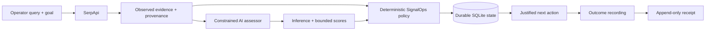

# AI Builders Hackathon 2026 — SignalOps Submission Pack

## Project
**SignalOps — Live Evidence Decision Layer**

## One-line pitch
SignalOps turns live external signals into inspectable, provenance-preserving, AI-assisted decisions without allowing model inference to silently become fact or authorization.

## Problem
Teams can retrieve more market, hiring, customer, and technical signals than they can safely evaluate. The operational failure is not search itself: it is deciding what deserves action while preserving what the source actually said, keeping AI interpretation separate, enforcing permission boundaries, and recording what happened afterward.

## Target users
Small technical teams, founders, GTM engineers, recruiting/market-intelligence operators, and other teams that repeatedly inspect public external evidence before deciding what action is justified.

## Product workflow

```text
live external signal
→ provenance-bearing observed evidence
→ separate bounded AI inference
→ deterministic policy decision
→ durable external identity
→ append-only outcome receipt
```

## What the working product does
1. Operator enters a live search query and decision goal.
2. SerpApi retrieves current structured web evidence.
3. SignalOps preserves source URL, search provenance, position, freshness when available, and source-provided observed language.
4. A constrained AI assessor may propose a falsifiable interpretation and bounded scores.
5. Deterministic SignalOps policy — not the model — authorizes the next action.
6. Repeated evidence preserves stable external identity.
7. The operator can inspect the original source and record a later outcome.
8. Outcomes append as new receipt events rather than rewriting the original evidence.

## Why AI is necessary
The AI layer interprets noisy, heterogeneous public evidence against an operator-supplied goal. It converts unstructured source language into a bounded hypothesis plus relevance, urgency, and conversation scores. The system deliberately limits AI authority: interpretation is useful, but permission to act remains deterministic and inspectable.

## Differentiation
Most search + AI products stop at retrieval, summarization, lead scoring, or autonomous action. SignalOps makes the boundary between **source fact**, **AI inference**, **policy authorization**, and **observed outcome** explicit and durable.

Core invariant:

> The model may interpret evidence, but it cannot authorize the final action or rewrite what the source originally said.

## Technical architecture



### Technology
- Python
- FastAPI
- SerpApi Google Search API
- OpenAI Responses API
- deterministic SignalOps policy engine
- SQLite durable state
- Docker
- Google Cloud Run proof path
- GitHub Actions

## Safety / trust boundaries
- Missing or rejected source credentials fail explicitly.
- Source-provided language remains separate from AI inference.
- AI scores are bounded and schema-validated.
- AI cannot authorize final external action.
- Repeated evidence keeps a stable identity.
- Outcome events append without mutating original evidence.
- API keys never appear in public receipts.

## Real-world value
SignalOps targets a common decision bottleneck: teams spend substantial operator attention reading public signals, deciding which ones matter, and reconstructing why a later action was taken. The product reduces that process to an inspectable queue while preserving the evidence and decision boundary required for accountable action.

No realized revenue, time savings, conversion uplift, or production-scale claim is made without external receipts.

## AI Builders judging map

### Technical Implementation — 25%
- real external-data acquisition;
- constrained AI assessor;
- deterministic policy authority;
- durable identity;
- append-only outcomes;
- FastAPI product surface;
- explicit failure handling and schema validation;
- CI / container / deployment proof path.

### Problem Solving & Impact — 25%
- addresses the high-frequency gap between abundant external signals and scarce operator attention;
- applies across GTM, recruiting, customer intelligence, technical growth, and other public-signal workflows;
- preserves accountability instead of optimizing only for automation speed.

### Innovation & Creativity — 20%
- separates evidence, inference, authorization, and outcome as distinct inspectable states;
- treats LLM output as bounded interpretation rather than implicit authority;
- preserves source provenance and later consequence in one workflow.

### User Experience & Design — 15%
The judge-facing product keeps the workflow on one surface: query → observed evidence → AI inference → policy decision → source inspection → outcome receipt.

### Presentation & Demo — 15%
The demo will show one complete live path plus the explicit trust boundary. No unrelated repository tour.

## Hackathon-period / pre-existing-work disclosure
SignalOps contains a pre-existing deterministic policy/state core. The hackathon-period product work reuses that core and adds the live external-evidence acquisition path, constrained AI assessment, judge-facing discovery workflow, outcome-receipt surface, live proof/deployment path, and AI Builders-specific product presentation.

This submission does not claim that all historical SignalOps work was created during the AI Builders event.

## Source
Canonical repository:
https://github.com/leadingproblemsolver/signalops-workbench

AI Builders branch:
https://github.com/leadingproblemsolver/signalops-workbench/tree/hackathon/ai-builders-signalops

## Working-product entry point
Use the current SignalOps × SerpApi judge surface until the AI Builders-specific public deployment is produced.

Implementation:
https://github.com/leadingproblemsolver/signalops-workbench/blob/hackathon/ai-builders-signalops/src/signalops/hackathon.py

## Demo contract
The 3–5 minute video must visibly establish:

```text
problem + target user
→ live query
→ live external result
→ source provenance
→ observed evidence
→ separate AI inference
→ deterministic action + reason
→ source inspection
→ recorded outcome receipt
→ close on product value
```

## Submission completion gate

```text
[x] product concept locked
[x] public source repository
[x] working FastAPI product surface
[x] live evidence adapter
[x] AI interpretation layer
[x] deterministic authority boundary
[x] durable identity + outcome history
[x] explicit pre-existing-work disclosure
[x] AI Builders branch created during hackathon period
[ ] AI Builders product framing visible in UI
[ ] current credentialed end-to-end run captured
[ ] public working-product URL
[ ] 3–5 minute video
[ ] <=10-slide presentation deck
[ ] final Devpost fields
[ ] submit
```

## Freeze rule
No new architecture, providers, autonomous-action modes, dashboards, or generalized agent framework before the remaining external completion items are closed. Patch only concrete defects exposed by the working-product or submission path.
