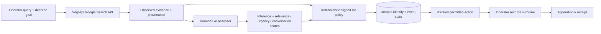

# Architecture

SignalOps is a bounded decision layer between external market evidence and downstream GTM action.

## Current judge/runtime path



### Authority boundary

```text
SerpApi owns:
- live web acquisition
- source URL / search provenance
- source-provided observed language

AI owns:
- bounded interpretation against the operator goal
- relevance / urgency / conversation scoring

Deterministic SignalOps host owns:
- stable external identity
- score formula
- permission thresholds
- final action authorization
- durable event history

Operator owns:
- real external intervention
- outcome classification / notes
```

The current AI implementation is `src/signalops/serp_ai.py`, using the OpenAI Responses API with the model configured by `OPENAI_MODEL` (default `gpt-5.6-luna`). The model cannot authorize the final action.

## Core decision contract

```text
observe
→ preserve evidence
→ separate fact / inference
→ score deterministically
→ enforce permission
→ rank intervention
→ hand off
→ record observed outcome
```

Current deterministic score:

```text
0.50 × relevance + 0.30 × conversation + 0.20 × urgency
```

Private escalation remains policy-gated; a high score alone is insufficient where prior public response is required.

## Persistence

The core `Store` uses SQLite with append-only event history plus a transactional projection. This is sufficient for local/reproducible technical proof.

The current Cloud Run hackathon deployment sets `SIGNALOPS_DB=/tmp/signalops-hackathon.db`; `/tmp` is ephemeral across instance lifecycle. **Persistent production use therefore requires moving the state path to a durable backend (for example Cloud SQL / another supported durable store) before claiming production-grade persistence.**

## Existing downstream GTM boundary

The repository already contains bounded Clay and HubSpot integration work:

```text
Clay search / enrichment
→ evidence-bounded normalization
→ SignalOps decision surface
→ CRM-safe projection
→ HubSpot bounded write
→ fresh read-back reconciliation
```

See [`GTM_STACK_PROOF_RUN_2026_08_22.md`](GTM_STACK_PROOF_RUN_2026_08_22.md).

This architecture intentionally does not treat enrichment output, AI inference, HTTP success, or human intent as proof of settled external state. Stronger claims require an explicit receipt or independent reread.

## Productization direction

Highest-value extensions are not a generic rewrite. They are:

1. multi-engine SerpApi acquisition (Search + News + Jobs + Trends; Maps only where local intent matters);
2. cross-engine provenance + deduplication;
3. trigger/freshness/change detection over time;
4. durable multi-user persistence;
5. measurable ranking evaluation against human labels and external outcomes;
6. one explicitly approved CRM write + read-back reconciliation;
7. scheduled monitors / webhooks only after selection quality is measured.

A modular monolith remains sufficient until real multi-user, volume, or connector evidence forces a split.
