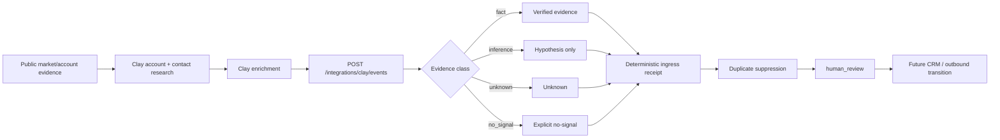

# SignalOps × Clay — Live Ingress Proof

**Employer-readable claim boundary:** SignalOps exposes a webhook-compatible HTTP ingress for Clay-resolved GTM evidence. It preserves fact/inference/unknown/no-signal classes, creates a deterministic append-only receipt, suppresses duplicate writes, and stops at `human_review`. It does **not** send outreach or mutate a CRM.

## Architecture



Hard boundaries:

- `next_action = human_review`
- `send_actions_executed = false`
- `crm_mutation_executed = false`
- inferred values are never promoted to facts
- `no_signal` explicitly blocks personalization eligibility

## Run locally

```bash
python -m venv .venv
# Windows: .venv\Scripts\activate
# macOS/Linux: source .venv/bin/activate
pip install -e .

export SIGNALOPS_CLAY_WEBHOOK_TOKEN="replace-with-random-secret"
export SIGNALOPS_GTM_RECEIPTS="data/gtm_ingress_receipts.jsonl"
uvicorn signalops.gtm_web:app --host 0.0.0.0 --port 8000
```

PowerShell:

```powershell
$env:SIGNALOPS_CLAY_WEBHOOK_TOKEN="replace-with-random-secret"
$env:SIGNALOPS_GTM_RECEIPTS="data/gtm_ingress_receipts.jsonl"
uvicorn signalops.gtm_web:app --host 0.0.0.0 --port 8000
```

Health check:

```bash
curl http://localhost:8000/health
```

## Exact Clay → SignalOps contract

Map one Clay row into this payload:

```json
{
  "account": {
    "name": "Example Logistics",
    "domain": "example.com"
  },
  "contact": {
    "title": "Digital Transformation Director",
    "source_id": "clay-stable-entity-id"
  },
  "signals": [
    {
      "type": "fact",
      "value": "Public profile describes ERP/WMS/CRM integration leadership",
      "source_ref": "https://public-source.example/item"
    }
  ],
  "fit_reasons": [
    "role owns systems integration"
  ]
}
```

Allowed signal types are exactly:

- `fact`
- `inference`
- `unknown`
- `no_signal`

When Clay's research returns `no strong signal`, map it explicitly as:

```json
{
  "type": "no_signal",
  "value": "no strong signal",
  "source_ref": "clay:enrichment:human-signal"
}
```

Do not replace it with generic praise or inferred affinity.

## Request

```bash
curl -X POST "https://YOUR-DEPLOYMENT/integrations/clay/events" \
  -H "Content-Type: application/json" \
  -H "X-SignalOps-Webhook-Token: YOUR_SECRET" \
  --data @examples/gtm_clay_ingress_fixture.json
```

Expected response shape:

```json
{
  "status": "recorded",
  "persisted": true,
  "receipt": {
    "schema_version": "2026-08-28.v1",
    "receipt_id": "stable-sha-derived-id",
    "source": "clay",
    "account_name": "Example Logistics",
    "account_domain": "example.com",
    "contact_title": "Digital Transformation Director",
    "contact_source_id": "clay-stable-entity-id",
    "evidence_counts": {
      "fact": 1,
      "inference": 0,
      "no_signal": 0,
      "unknown": 0
    },
    "fit_reasons": ["role owns systems integration"],
    "personalization_state": "eligible",
    "next_action": "human_review",
    "send_actions_executed": false,
    "crm_mutation_executed": false
  }
}
```

Submitting the exact same normalized event again returns `status: duplicate` and `persisted: false`.

## Current evidence state

### Implemented / testable without secrets

- webhook-compatible HTTP contract
- deterministic receipt ID
- evidence-class preservation
- explicit no-signal handling
- duplicate suppression
- append-only JSONL receipt store
- optional shared-secret boundary
- human-review terminal state
- hard `send=false` and `crm_mutation=false` invariants

### HITL / external receipt still required

The repository must not claim a **live Clay → deployed SignalOps webhook** until one real Clay row is sent to a deployed endpoint and the resulting receipt is preserved.

Exact human actions are listed below.

## HITL checklist — live receipt

1. Deploy branch `feat/gtm-live-integration-proof-2026-08-28` with command:
   `uvicorn signalops.gtm_web:app --host 0.0.0.0 --port $PORT`
2. Set `SIGNALOPS_CLAY_WEBHOOK_TOKEN` to a new random secret in the deployment environment. Do not commit it.
3. Set `SIGNALOPS_GTM_RECEIPTS=data/gtm_ingress_receipts.jsonl` or a persistent mounted path supported by the host.
4. Confirm `GET /health` returns `{"status":"ok","surface":"gtm-integration-proof"}`.
5. In Clay, use one existing qualified row from the current logistics cohort; do **not** expose raw email in the payload.
6. Map:
   - Company Name → `account.name`
   - Company Domain → `account.domain`
   - Job Title → `contact.title`
   - Clay entity ID → `contact.source_id`
   - public/research evidence → `signals[]`
   - explicit operator fit reason → `fit_reasons[]`
7. Configure Clay's HTTP/webhook action to POST to `https://<deployment>/integrations/clay/events` with header `X-SignalOps-Webhook-Token` equal to the deployment secret.
8. Run the action for **one row only**.
9. Verify the response has:
   - `persisted: true`
   - `next_action: human_review`
   - `send_actions_executed: false`
   - `crm_mutation_executed: false`
10. Re-run the exact same row once. Verify:
    - `status: duplicate`
    - `persisted: false`
11. Preserve a sanitized response JSON or screenshot as the external execution receipt. Remove secrets and raw email.
12. Only after steps 1–11 may the employer-facing claim become: **"Executed a live Clay → SignalOps HTTP integration with deterministic duplicate suppression and human-review gating."**

## Next transition

After the live Clay ingress receipt, the next proof is one explicitly approved HubSpot company update followed by read-back reconciliation. Existing `signalops.crm` code already implements the bounded search/update/read-back primitives; the remaining gap is a real authorized write receipt, not another CRM abstraction.
