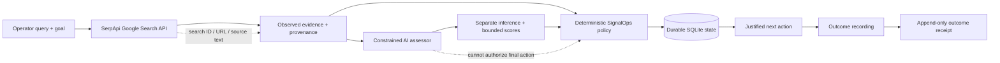

# Devpost Submission — SignalOps × SerpApi

## Project name
Recovery TaskMaster — SignalOps × SerpApi — External Opportunity Decision Agent

## One-line pitch
Turn live web evidence into a provenance-preserving, AI-assisted, policy-gated queue of justified external actions.

## The problem
Teams can retrieve more external signals than they can safely act on: hiring posts, product launches, technical issues, customer complaints, and market changes. The hard part is not search itself. It is deciding which live evidence deserves action without quietly turning an LLM interpretation into a fact, losing the original source, or rewriting history after an outcome occurs.

## What it does
SignalOps × SerpApi starts with structured live search data from SerpApi and preserves the source URL, SerpApi search ID, result position, freshness fields when available, and source-provided language.

A constrained AI assessor may then propose a falsifiable interpretation plus bounded relevance, urgency, and conversation scores. **The model cannot authorize the final action.** The deterministic SignalOps policy resolves the next action, durable state preserves a stable external identity, and later outcomes append as immutable events rather than rewriting the evidence that produced the decision.

```text
live SerpApi result
→ provenance-bearing observed evidence
→ separate bounded AI inference
→ deterministic policy decision
→ durable external identity
→ append-only outcome receipt
```

## Why SerpApi is functionally central
Without SerpApi, this application has no live web acquisition layer. SerpApi is not a decorative call or enrichment step: it supplies the factual input on which every downstream interpretation and decision depends.

The judge-facing path retains SerpApi search IDs, source URLs, positions, dates when available, titles, and observed snippets through the decision flow. A successful live proof must contain a real SerpApi search ID before the workflow is considered verified.

## User workflow
1. Enter a current search query and decision goal.
2. SerpApi returns structured live web evidence.
3. Inspect **Observed evidence** separately from **AI inference**.
4. See the deterministic SignalOps action, score, and policy reason.
5. Open the underlying source directly.
6. Record an outcome.
7. Receive an append-only outcome receipt without altering the original evidence event.

## Architecture



**Authority boundary:** SerpApi supplies evidence; AI interprets within a bounded schema; deterministic host policy owns action authorization; durable state owns identity and outcome history.

## Failure and trust boundaries
- Missing or rejected SerpApi credentials fail explicitly rather than becoming empty evidence.
- SerpApi JSON must have the expected structure; API errors are not silently treated as no results.
- AI scores must remain within `0..10`.
- AI output count and indices must exactly match the supplied evidence.
- Source-provided language stays separate from inference.
- Repeated evidence must preserve the same stable external ID.
- Outcome receipts append to event history and do not mutate the original observed evidence.
- No API key is written into public receipts.

## Judging criteria → proof map

### SerpApi — Best AI Use Case

**Originality**  
Most search + AI applications stop at retrieval, summarization, or recommendations. SignalOps treats live search as evidence entering a controlled decision system in which observed language, model inference, deterministic authorization, durable identity, and later outcome are separately inspectable states.

**Technical execution**  
Real SerpApi adapter, explicit error handling, bounded AI schema, deterministic policy authority, stable repeated-evidence identity, append-only outcomes, FastAPI UI/API, Docker, CI, Cloud Run deployment, keyless Google authentication, and machine-checkable live receipts.

**SerpApi integration**  
SerpApi is the factual acquisition layer. The live workflow requires a real SerpApi search ID and carries source-linked fields through downstream decisions.

**Usability**  
The judge-facing UI exposes the complete workflow in one surface: query → source evidence → AI inference → deterministic decision → source inspection → outcome receipt.

**Potential impact**  
The architecture targets a common operational failure in GTM, recruiting, customer intelligence, and technical growth: acting on noisy external signals after their factual basis has been obscured by model interpretation.

### Overall hackathon criteria

**Progress** — working acquisition, AI, policy, durable identity, outcome recording, tests, container, Cloud Run workflow, and receipt pipeline are implemented.  
**Concept** — solves the concrete problem of turning abundant live signals into inspectable, justified actions rather than more summaries.  
**Feasibility** — the product boundary is narrow and deployable: APIs for acquisition and interpretation, deterministic host policy for authority, SQLite for the current durable state layer, and a small web surface for operators.

## Built with
- SerpApi Google Search API
- OpenAI Responses API (`gpt-5.6-luna`)
- Python 3.11–3.13
- FastAPI
- SQLite
- deterministic SignalOps policy engine
- Docker / Google Cloud Run
- GitHub Actions
- GitHub OIDC → Google Workload Identity Federation

## Pre-existing work disclosure
The hackathon-specific application layer includes the SerpApi acquisition adapter, constrained AI assessor, judge-facing discovery UI, immutable outcome-receipt surface, credentialed live acceptance tooling, Cloud Run proof workflow, and submission material.

It explicitly reuses the pre-existing SignalOps deterministic policy/state core. This submission does not claim that the original SignalOps workbench was created during the event.

## Source
https://github.com/leadingproblemsolver/signalops-workbench

Hackathon implementation files:
- [`src/signalops/serpapi.py`](../src/signalops/serpapi.py)
- [`src/signalops/serp_ai.py`](../src/signalops/serp_ai.py)
- [`src/signalops/hackathon.py`](../src/signalops/hackathon.py)
- [`scripts/hackathon_live_smoke.py`](../scripts/hackathon_live_smoke.py)
- [canonical live deploy + receipt workflow](../.github/workflows/hackathon-live-deploy.yml)

## Public live proof
Pending until the credentialed workflow reaches `VERIFIED`:

- **Demo URL:** `PENDING_LIVE_DEPLOY`
- **Sanitized receipt:** https://github.com/leadingproblemsolver/signalops-workbench/blob/proof/serpapi-live-status/proof/serpapi-live-latest.json
- **Demo video:** `PENDING_VIDEO`

The public receipt is authoritative for the deployed source commit, Cloud Run URL/revision, SerpApi provenance search ID presence, stable repeated-evidence identity, deployed discovery, and append-only outcome event.

## Canonical live proof path
There is one submission proof workflow: `.github/workflows/hackathon-live-deploy.yml`.

It must perform, in order:

```text
deterministic repository tests
→ real SerpApi credential acceptance + search ID
→ credentialed SerpApi + AI smoke run
→ keyless GitHub OIDC / Google WIF authentication
→ exact-source Cloud Run deployment
→ required /health verification
→ deployed live discovery
→ deployed append-only outcome receipt
→ bounded receipt-index.json
→ public proof/serpapi-live-status receipt
```

A run is `VERIFIED` only if both the pre-deploy credentialed path and deployed discovery/outcome path succeed.

## 2–4 minute judge demo

### 0:00–0:22 — Problem
> Live search is easy. The hard part is deciding what deserves action without losing the source or turning model inference into fact.

### 0:22–0:42 — Architecture
Show the architecture diagram and say:
> SerpApi owns live evidence acquisition. AI may interpret it. Deterministic SignalOps policy—not the model—authorizes the next action, and later outcomes are recorded separately.

### 0:42–1:35 — Live SerpApi acquisition
Run one live query in the deployed UI. Show:
- live result count;
- SerpApi search ID in the receipt/API evidence;
- source URL;
- source-provided observed language;
- one underlying source opened directly.

### 1:35–2:15 — Evidence versus inference versus authority
For one result show:
- **Observed evidence**;
- **AI inference**;
- bounded scores;
- deterministic action and policy reason.

Say explicitly:
> The model can propose an interpretation, but it cannot authorize the final action.

### 2:15–2:45 — Durable identity + outcome
Show repeated evidence preserving the same external ID. Record one outcome and show `outcome_recorded` while the original evidence remains unchanged.

### 2:45–3:15 — Production proof
Show:
- Cloud Run service + ready revision;
- `/health` with both integrations configured;
- public proof receipt with `proof_status: VERIFIED`;
- exact source commit SHA.

### 3:15–3:28 — Close
> SerpApi gives SignalOps live evidence. AI interprets it. Deterministic policy decides whether it deserves action. Immutable receipts preserve what happened next.

Stop. Do not tour unrelated SignalOps features.

## Current proof state

Verified from repository implementation/tests:
- real SerpApi adapter and provenance contract;
- explicit SerpApi/API failure handling;
- constrained AI schema and bounded score validation;
- deterministic policy remains the final action authority;
- stable repeated-evidence identity logic;
- append-only outcome logic;
- judge-facing FastAPI surface;
- Docker/Cloud Run container entrypoint;
- pre-existing-work disclosure;
- canonical keyless live-proof workflow staged.

Still external and therefore not claimable until the public receipt says `VERIFIED`:
- real SerpApi + OpenAI credentialed acceptance;
- public Cloud Run URL/revision;
- deployed live discovery;
- deployed outcome receipt;
- public demo video;
- final Devpost submission;
- judge response / placement.

## Submission completion gate

```text
[x] meaningful real-world problem
[x] SerpApi functionally central to the application
[x] observed evidence kept separate from AI inference
[x] model blocked from final action authority
[x] deterministic failure and boundary tests
[x] durable repeated-evidence identity
[x] append-only outcome receipt
[x] judge-facing UI/API
[x] architecture diagram
[x] explicit pre-existing-work disclosure
[x] one canonical keyless deployment/proof workflow
[ ] SERPAPI_API_KEY + OPENAI_API_KEY available to workflow
[ ] signalops-workbench authorized on existing Google WIF deployer
[ ] public receipt reaches proof_status: VERIFIED
[ ] 2–4 minute demo video
[ ] Devpost final fields + submit
```

No new product architecture before those five external completion items.

## Claim boundary
When the public live receipt reaches `VERIFIED`, it proves one real source-linked SerpApi + AI + deterministic policy + durable state run on the exact Cloud Run deployment recorded in that receipt. It does not prove customer adoption, realized financial savings, production scale, conversion, revenue, or hackathon placement.
