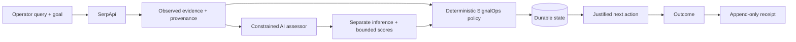

# Recovery TaskMaster
# SignalOps × SerpApi — External Opportunity Decision Agent

**One-line pitch:** Turn live web evidence into a provenance-preserving, AI-assisted, policy-gated queue of justified external actions.

## Hackathon lineage disclosure

The judge-facing application layer is the SerpApi acquisition adapter, constrained AI assessor, judge UI, immutable outcome-receipt surface, live acceptance script, Cloud Run deployment/proof workflow, and submission material. It reuses the pre-existing SignalOps deterministic policy/state core as an explicitly disclosed component; do not imply the original workbench was created during the event.

## Why SerpApi is central

SignalOps previously accepted manually supplied public evidence. The hackathon application adds a live acquisition path powered by SerpApi's Google Search API:

```text
SerpApi live result
→ source-linked observed evidence
→ constrained AI interpretation
→ deterministic SignalOps policy
→ durable action identity
→ append-only outcome receipt
```

Without SerpApi, the hackathon application has no live web acquisition layer. A successful live proof must contain a real SerpApi search ID.

## Architecture and authority boundary



- SerpApi supplies source URL, title, snippet, freshness metadata when available, position, and search ID.
- Source-provided language is stored as observed evidence.
- The AI assessor may produce only a separate inference plus bounded relevance/urgency/conversation scores.
- The model cannot authorize outreach or overwrite observed evidence.
- SignalOps policy deterministically resolves the next action.
- SQLite preserves durable surfaces and immutable event history.
- Outcome receipts append and never rewrite the original evidence event.

## Run locally

```bash
export SERPAPI_API_KEY='...'
export OPENAI_API_KEY='...'
export OPENAI_MODEL='gpt-5.6-luna'
export SIGNALOPS_DB='data/hackathon.db'

python -m pip install -e .
uvicorn signalops.hackathon:app --reload
```

Open `http://127.0.0.1:8000`.

## Judge workflow

1. Enter a current search query and decision goal.
2. Click **Discover and resolve**.
3. Show the live result count and provenance-bearing source cards.
4. Open one source directly.
5. Contrast **Observed evidence** with **AI inference**.
6. Show deterministic action + score + policy reason.
7. Record an outcome and show the append-only receipt.
8. Show the public live-status receipt tied to the exact Cloud Run revision/source commit.

## Deterministic gates

```bash
python -m unittest discover -s tests -v
python scripts/smoke_test.py
```

The SerpApi/AI tests cover normal structured results plus explicit failures: missing/invalid credentials, malformed API payloads, bounded result limits, missing snippets, invalid AI scores, and output-shape/index constraints.

## One canonical live proof workflow

Use only:

`.github/workflows/hackathon-live-deploy.yml`

It performs:

```text
repository tests
→ real SerpApi key acceptance + provenance search ID
→ credentialed SerpApi + OpenAI smoke run
→ GitHub OIDC / Google Workload Identity Federation
→ exact-source Cloud Run deploy
→ required /health verification
→ deployed live discovery
→ deployed append-only outcome
→ bounded receipt
→ public proof branch
```

Expected public receipt after the workflow runs:

https://github.com/leadingproblemsolver/signalops-workbench/blob/proof/serpapi-live-status/proof/serpapi-live-latest.json

## External prerequisites

Repository Actions secrets:
- `SERPAPI_API_KEY`
- `OPENAI_API_KEY`

Google WIF must authorize this repository to impersonate:

`recovery-taskmaster-deployer@signalops-506419.iam.gserviceaccount.com`

One-time binding:

```bash
gcloud iam service-accounts add-iam-policy-binding \
  recovery-taskmaster-deployer@signalops-506419.iam.gserviceaccount.com \
  --project signalops-506419 \
  --role roles/iam.workloadIdentityUser \
  --member "principalSet://iam.googleapis.com/projects/625265193189/locations/global/workloadIdentityPools/github-actions/attribute.repository/leadingproblemsolver/signalops-workbench"
```

No JSON Google service-account key is required or accepted by the canonical workflow.

## Live acceptance definition

`proof_status: VERIFIED` requires all of the following in one run:

- deterministic tests pass;
- real SerpApi request returns a search ID;
- real OpenAI assessment completes;
- repeated evidence preserves the same stable external ID;
- public Cloud Run service becomes healthy;
- deployed service returns at least one live source-linked decision;
- deployed outcome endpoint appends `outcome_recorded`;
- sanitized receipt records exact source commit, Cloud Run URL, and revision.

## Claim boundary

A `VERIFIED` live receipt proves one real source-linked SerpApi + AI + deterministic-policy + durable-state run on the exact Cloud Run deployment named in the receipt. It does **not** prove customer demand, conversion, revenue, production scale, realized financial savings, or hackathon placement.

## Stop condition

Once the live receipt is `VERIFIED`, do only:

```text
record 2–4 minute demo
→ fill Devpost
→ submit
→ freeze
```

Do not add another provider, agent, dashboard, database, or architecture layer before submission.
