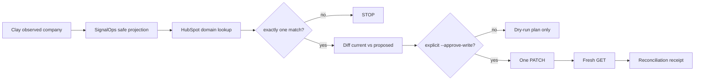

# SignalOps × HubSpot — Bounded Write + Read-Back Proof

## What already exists

`signalops.crm` already implements and tests the important technical boundary:

1. exact company lookup by normalized domain;
2. refusal when one domain matches multiple companies;
3. deterministic Clay -> HubSpot projection;
4. allow-list limited to `name`, `domain`, and opt-in `description`;
5. exactly one company `PATCH`;
6. exactly one fresh verification `GET`;
7. reconciliation receipt comparing intended vs observed state;
8. explicit HTTP/authorization failures.

`tests/test_hubspot_client.py` verifies the PATCH -> GET sequence and rejects arbitrary enrichment fields such as `tech_stack`.

The new `scripts/hubspot_bounded_write.py` makes the proof executable while remaining dry-run-first.

## Architecture



No company creation is implemented in this proof runner.

## Current external authorization state — 2026-08-28

Connected HubSpot capability inspection showed:

- `COMPANY.read = AVAILABLE`
- `CONTACT.read = AVAILABLE`
- `DEAL.read = AVAILABLE`
- `COMPANY.write = REQUIRES_REAUTHORIZATION`
- `CONTACT.write = REQUIRES_REAUTHORIZATION`
- `DEAL.write = REQUIRES_REAUTHORIZATION`

Therefore **no live HubSpot mutation is currently claimed**. A real write receipt requires human reauthorization and explicit approval.

## Dry-run first

Keep the HubSpot credential outside GitHub:

```bash
export HUBSPOT_ACCESS_TOKEN="<private-app-or-OAuth-token>"
```

PowerShell:

```powershell
$env:HUBSPOT_ACCESS_TOKEN="<private-app-or-OAuth-token>"
```

Preview one existing company record:

```bash
python scripts/hubspot_bounded_write.py \
  --company-name "TEST COMPANY NAME" \
  --domain "test-company.example" \
  --source-url "https://public-source.example/company" \
  --observed-description "Observed public company description" \
  --expected-object-id "HUBSPOT_OBJECT_ID" \
  --receipt-out proof/hubspot-write-preview.json
```

The default path performs a HubSpot read/search only. It must output either:

- `status: approval_required` with an exact `changes` diff; or
- `status: no_change` when there is nothing to mutate.

It must keep `executed: false`.

## Live proof command — only after human approval

When the preview is correct and the exact target/value changes are explicitly approved:

```bash
python scripts/hubspot_bounded_write.py \
  --company-name "APPROVED NAME" \
  --domain "approved-domain.example" \
  --source-url "https://public-source.example/company" \
  --observed-description "Observed public company description" \
  --expected-object-id "APPROVED_HUBSPOT_OBJECT_ID" \
  --approve-write \
  --receipt-out proof/hubspot-write-live.json
```

Only add `--include-description` if the observed source description itself is an explicitly approved field update.

Expected successful terminal receipt:

```json
{
  "status": "verified",
  "executed": true,
  "authorization": "explicit_cli_flag",
  "hubspot_object_id": "...",
  "changes": {
    "name": {
      "current": "...",
      "proposed": "..."
    }
  },
  "reconciliation_diff": []
}
```

## HITL checklist — exact

1. **Choose a disposable/test HubSpot COMPANY record**. Do not use a live customer record for portfolio proof.
2. Confirm its domain is unique in HubSpot.
3. Record its exact HubSpot company object ID.
4. Decide the smallest harmless observed-field change that can be reverted, preferably `name` on a dedicated test record.
5. Reauthorize HubSpot write access if using the connected HubSpot integration. Current write state is `REQUIRES_REAUTHORIZATION`.
6. If using the repo runner, create/use a HubSpot credential with only the scopes needed for company read/write; store it locally as `HUBSPOT_ACCESS_TOKEN`; never commit or paste it into public proof.
7. Run the command **without** `--approve-write` first.
8. Inspect the emitted `changes` object. It must show the exact current and proposed values.
9. Verify `hubspot_object_id` matches the test record selected in step 1.
10. Explicitly approve that one field change.
11. Re-run with `--approve-write`.
12. Confirm the receipt reports:
    - `status: verified`
    - `executed: true`
    - `reconciliation_diff: []`
13. Open HubSpot and confirm the test record displays the intended value.
14. Preserve a sanitized screenshot + `proof/hubspot-write-live.json`; remove credentials and unrelated CRM data.
15. Revert the test field through the same bounded process if desired, preserving the revert receipt separately.
16. Only then promote the employer-facing claim to: **"Implemented and executed a controlled Clay-to-HubSpot company update with domain deduplication, explicit human authorization, and fresh read-back reconciliation."**

## Do not claim yet

Until the live receipt exists, do not claim:

- production CRM synchronization;
- autonomous HubSpot updates;
- contact/deal lifecycle orchestration;
- customer adoption;
- pipeline or revenue impact.

## Next transition after this receipt

After one verified write/read-back receipt, add GTM lifecycle state + `/gtm` UI. Do not add another CRM connector first.
